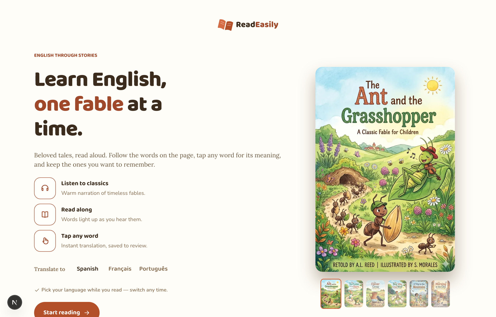
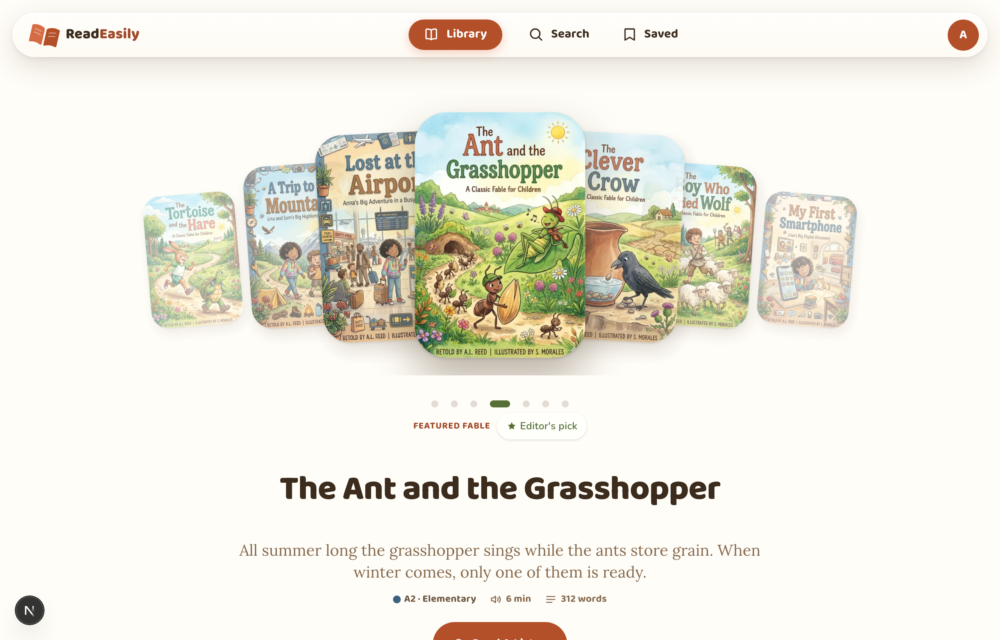
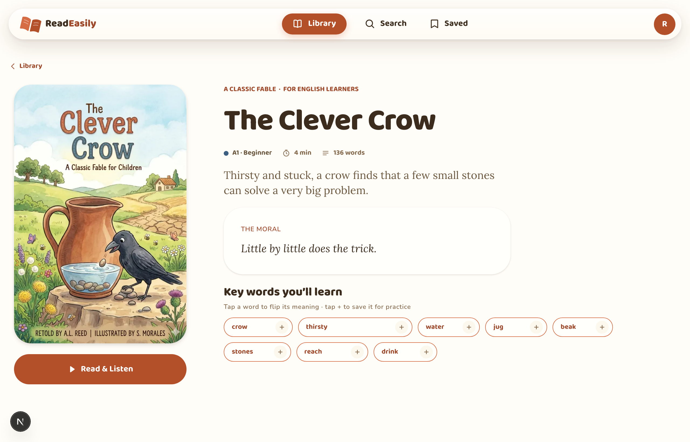
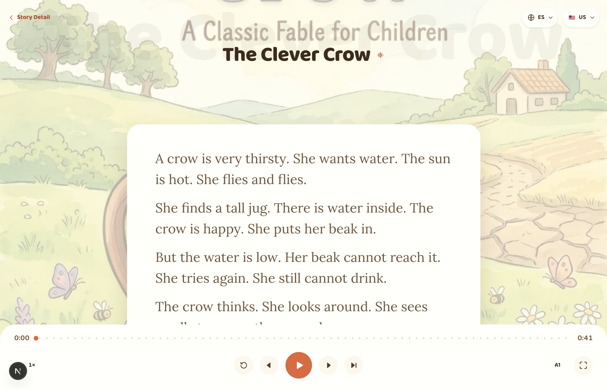
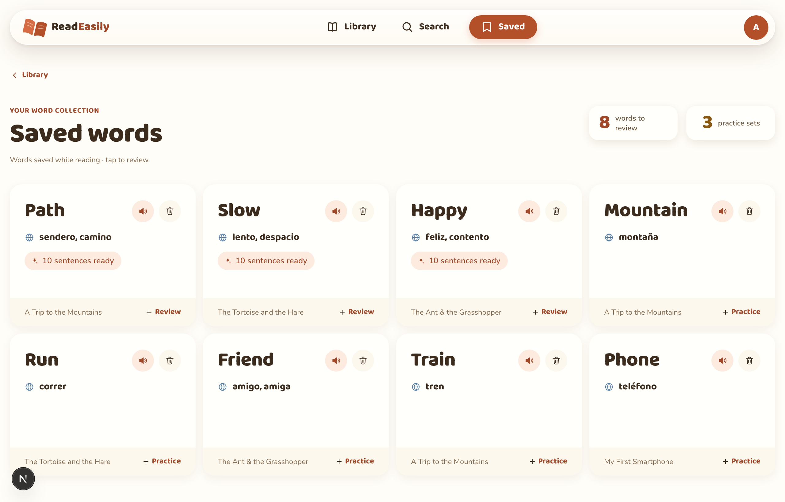

<div align="center">

# 📖 ReadEasily

**Learn English through short, illustrated stories — read · listen · translate · save words · practice.**

A warm, cozy reading app built 1:1 from a Figma design system into a fully tested Next.js app.

### [▶️ Live Demo](https://read-easily.vercel.app) &nbsp;·&nbsp; [🎨 Figma Design System](https://www.figma.com/design/sc9DIhX0wvFgrvmL8NVBf5/ReadEasily?node-id=0-1)

[](https://read-easily.vercel.app)
[](https://www.figma.com/design/sc9DIhX0wvFgrvmL8NVBf5/ReadEasily?node-id=0-1)
[](https://github.com/anakarinasuarez/ReadEasily/actions/workflows/ci.yml)


<sub>The live demo runs on mock data (no sign-in needed) — save words and practice with AI-generated sentences; your list persists per browser.</sub>

<br />



</div>

---

## Contents

- [What it does](#-what-it-does)
- [Preview](#-preview)
- [Stack](#-stack)
- [Getting started](#-getting-started)
- [Scripts](#-scripts)
- [Architecture](#-architecture)
- [Testing & quality](#-testing--quality)
- [Accessibility](#-accessibility)
- [Deployment](#-deployment)
- [Contributing](#-contributing)

## ✨ What it does

ReadEasily turns short, illustrated stories into a gentle English-learning loop:

- **📚 Read** — short stories graded by CEFR level (A1–C1), each with cozy, hand-drawn illustrations.
- **🎧 Listen** — every story read aloud with a synchronized, fully accessible player; the words light up as you hear them.
- **🌍 Translate** — tap any word for an instant translation (Spanish · Français · Português) without leaving the page.
- **🔖 Save** — keep the words you want to remember, gathered in one place.
- **✍️ Practice** — review saved words with example sentences generated on the fly (Google Gemini Flash, with a zero-cost template fallback so it works offline).

## 🖼️ Preview

<table>
  <tr>
    <td width="50%"><br /><sub><b>Library</b> — browse the illustrated catalog</sub></td>
    <td width="50%"><br /><sub><b>Story detail</b> — level, moral &amp; key words</sub></td>
  </tr>
  <tr>
    <td width="50%"><br /><sub><b>Reader</b> — read + listen, immersive full-screen</sub></td>
    <td width="50%"><br /><sub><b>Saved words</b> — your review list</sub></td>
  </tr>
</table>

> Screenshots are the real app running against mocked data. Regenerate them with
> `npm run dev` + `node scripts/capture-screenshots.mjs`.

## 🧱 Stack

- **Next.js 16** (App Router · React Server Components) · **React 19** · **TypeScript** (strict)
- **Tailwind CSS v4** with design tokens generated from Figma (the source of truth)
- **Radix UI** primitives · **Storybook** for the component library
- **Vitest + React Testing Library** (unit/behavior) · **Playwright** (e2e) · **jest-axe** (a11y)
- **MSW** for deterministic, mock-backed data in dev, tests and e2e
- Practice sentences via **Google Gemini Flash** (with a zero-cost template fallback)
- Deployed on **Vercel** · errors & Web Vitals via **Sentry**

## 🚀 Getting started

Requires the Node version in [`.nvmrc`](.nvmrc) and npm 10.

```bash
nvm use                       # Node 24 (see .nvmrc)
npm ci                        # install exact, locked dependencies
cp .env.example .env.local    # then fill in values (all optional for dev)
npm run dev                   # → http://localhost:3000
```

> The app runs fully **without any secrets**: Gemini falls back to template
> sentences and Sentry is a no-op until a DSN is set. See
> [`.env.example`](.env.example) for every variable and what it does.

## 📜 Scripts

| Command | What it does |
| --- | --- |
| `npm run dev` | Dev server (Turbopack) |
| `npm run build` | Production build (SSG/RSC) |
| `npm run start` | Serve the production build |
| `npm run lint` | ESLint |
| `npm run typecheck` | `tsc --noEmit` (strict) |
| `npm run test` | Vitest unit/component suite |
| `npm run test:watch` | Vitest in watch mode |
| `npm run e2e` | Playwright end-to-end journeys |
| `npm run storybook` | Storybook on :6006 |

## 🗂️ Architecture

Feature-sliced with colocation — a component lives with everything it owns
(`Component.tsx · .stories.tsx · .test.tsx · .figma.tsx · index.ts`).

```
src/
  tokens/        # generated from Figma — do not hand-edit
  ui/            # primitives (button, input, toggle, chip …) — 1:1 with Figma
  components/    # composites (navbar, player-bar, book-cover …)
  features/      # vertical slices: auth, library, reader, search, saved, profile, practice
  lib/           # supabase, audio, i18n, site, utils
  content/       # server-readable story catalog (SEO/SSG)
src/app/         # App Router routes = the prototype made real
e2e/             # Playwright journeys
tests/           # setup + MSW mocks
```

Build order is never skipped: `tokens → ui → composites → features → flows → e2e`.
The app is built by a roster of specialist agents (see [`.claude/agents/`](.claude/agents) and [CONTRIBUTING.md](CONTRIBUTING.md)).

## ✅ Testing & quality

Every change must pass, locally and in CI:

- **674 unit/component tests** (Vitest + RTL) — behavior, not implementation
- **Playwright e2e** for the critical journeys (browse → read → save → practice)
- **jest-axe** accessibility checks + keyboard operability + visible focus on every interactive component
- TypeScript strict (no `any`) · matches Figma · uses tokens, never hardcoded values
- `lint`, `typecheck`, `test`, `build` green

CI ([`.github/workflows/ci.yml`](.github/workflows/ci.yml)) runs all of these plus
a dependency-vulnerability audit on every pull request and on `main`.

## ♿ Accessibility

Accessibility is treated as craft, to **WCAG AA**: semantic markup, labelled
controls, managed focus across routes, visible focus rings, full keyboard
operability, `prefers-reduced-motion` honored, and AA-contrast color tokens
(muted text, interactive terracotta, info, success). Every component ships an
automated axe check.

## 🚢 Deployment

Live at **[read-easily.vercel.app](https://read-easily.vercel.app)**, hosted on
**Vercel** — every PR gets a preview deploy, `main` is production. The live demo
runs on mock data (MSW) so it's fully clickable without a backend. See the
**[deployment & rollback runbook](docs/RUNBOOK.md)** for the full procedure,
required environment variables, and how to roll back.

## 🤝 Contributing

See [CONTRIBUTING.md](CONTRIBUTING.md) for the branch/PR workflow, the Definition
of Done, and the specialist-agent roster that builds this app.
