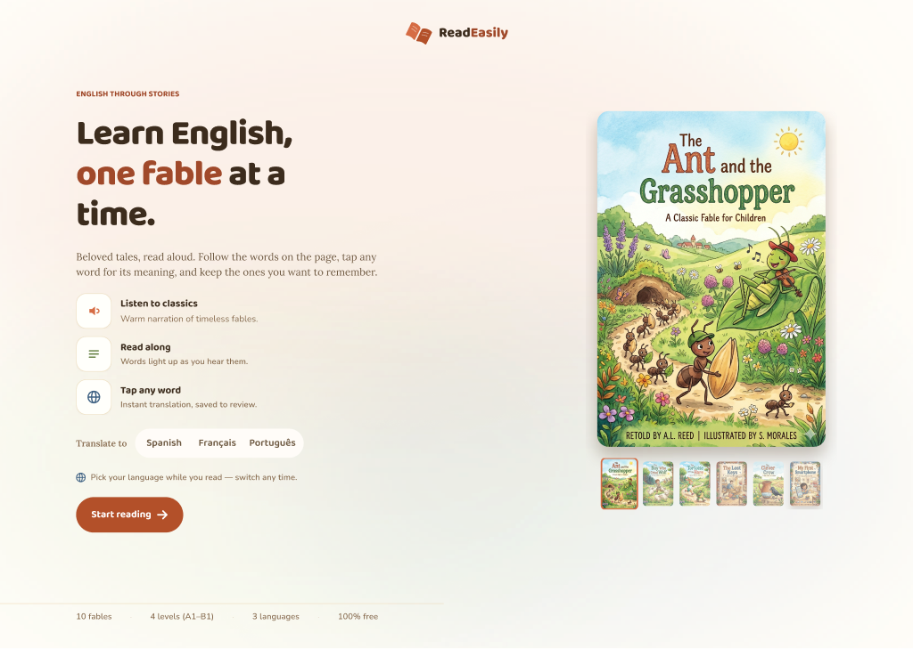
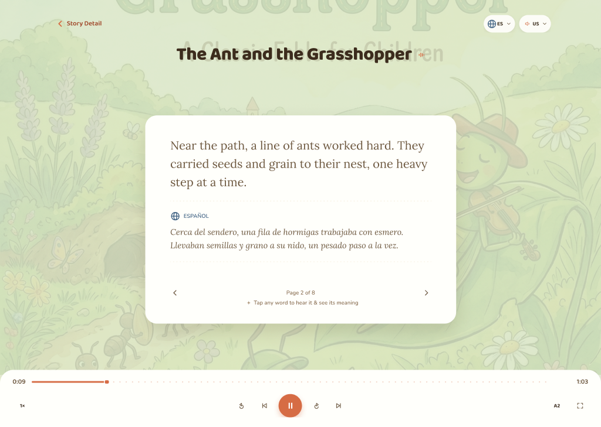
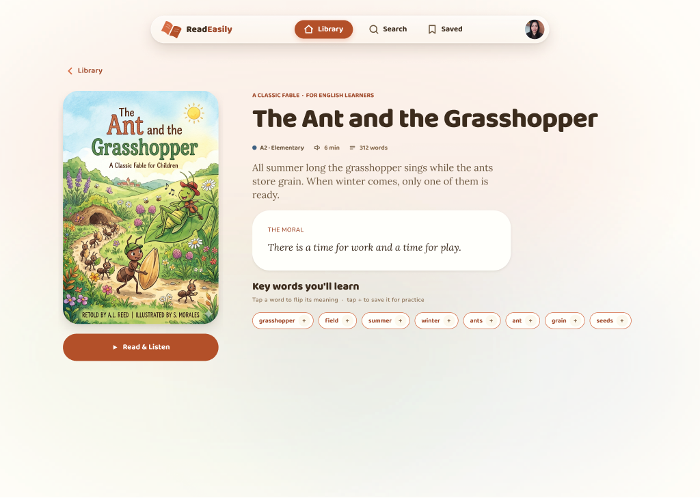
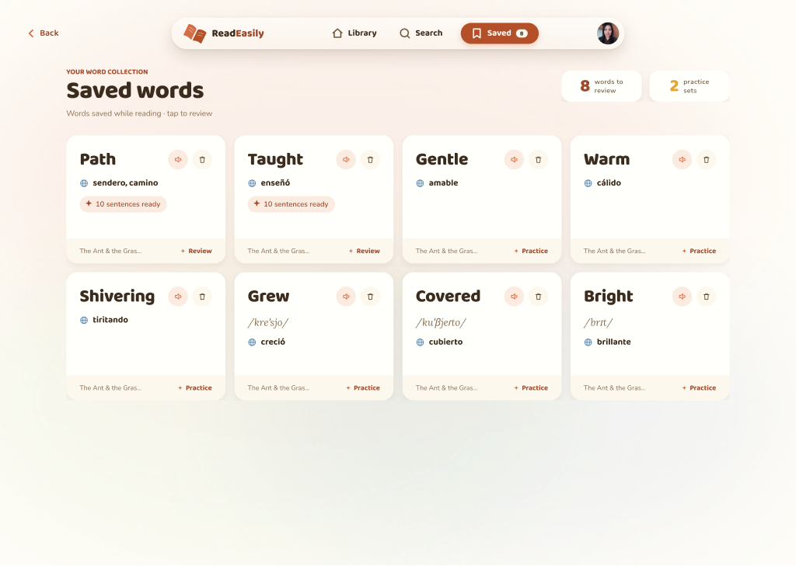

# ReadEasily — Case Study

> **De un artefacto de diseño a una app real, testeada y en producción.**
> Diseñé un design system completo en Figma y lo porté 1:1 a una app Next.js
> con tests, accesibilidad AA y despliegue continuo.

**🔗 Enlaces**
- ▶️ App en vivo: https://read-easily.vercel.app
- 🎨 Design system en Figma: https://www.figma.com/design/sc9DIhX0wvFgrvmL8NVBf5/ReadEasily?node-id=0-1
- 💻 Código: https://github.com/anakarinasuarez/ReadEasily

**Mi rol:** Diseño UX/UI + design systems (dirección de producto de principio a fin).
**Duración / tipo:** Proyecto personal para dominar el flujo diseño → código a nivel senior.
**Stack:** Next.js 16 · React 19 · TypeScript (strict) · Tailwind v4 · Figma (fuente de verdad).

---

## 1. El reto

Aprender inglés con apps suele sentirse frío: listas de vocabulario, tarjetas
sin alma, gamificación agresiva. Quise lo contrario: **un espacio cálido y
acogedor** donde aprendes leyendo cuentos cortos ilustrados —
leer · escuchar · traducir · guardar palabras · practicar.

Pero el reto real no era solo diseñar pantallas bonitas. Era demostrar que un
diseño puede convertirse en un **producto de verdad, mantenible y accesible**,
sin que se pierda una sola decisión de diseño por el camino.

**Objetivo:** un design system en Figma tan riguroso que se pudiera portar
1:1 a código — mismos tokens, mismos componentes, mismos estados — y que el
resultado en producción se viera y sintiera idéntico al diseño.

---

## 2. El proceso

Trabajé como si liderara un equipo, respetando un orden que nunca se salta:

```
Foundations → Components → Screens → Prototype   (Figma)
    tokens   →     ui     → composites → features → flows → e2e   (código)
```

Cada capa depende de la anterior. Empezar una pantalla sin sus componentes, o un
componente sin sus tokens, genera retrabajo. Esa disciplina fue la que mantuvo la
fidelidad diseño ↔ código.

### 2.1 Foundations — los tokens como contrato

El design system arranca en las **variables de Figma** (~125 tokens de color,
espaciado, radios, sombras; 22 estilos de texto). No son decoración: son el
**contrato de valores** que el código consume tal cual, como CSS custom
properties. Regla de oro del proyecto: **nunca un valor hardcodeado** — todo
resuelve a un token.

Decisiones de foundations con intención:
- **Terracota `#D97757`** como color de marca — un naranja cálido, no un rojo
  apagado. Da la sensación acogedora que define el producto.
- **Contraste AA real:** cuando un color de marca no pasaba AA sobre fondo claro,
  creé tokens específicos para uso interactivo (`bg/accent-strong`), texto info
  (`sky/700`), éxito (`forest/700`) y texto atenuado (`ink/500`). La
  accesibilidad se resolvió **en la capa de tokens**, no parcheando componentes.

### 2.2 Components — la librería 1:1

Construí la librería de componentes en Figma con su modelo de variantes
(estados, tamaños, selección) y la repliqué en código: **~10 primitivas**
(Button, Input, Toggle, Badge, Chip, Avatar, IconButton, SearchField,
SegmentedControl, WordToken) y **~17 composites** (Navbar, PlayerBar, BookCard,
BookShowcase, AccountMenu, WordPopover, Modal, SettingsRow…).

Decisiones de componentes con criterio de sistema:
- **Chip dedicado** para filtros de categoría (con propiedad `Selected`), en vez
  de reusar Button o Badge — semántica correcta desde el diseño.
- **Iconos de features en cuadrados redondeados**, no en círculos — coherencia
  visual del lenguaje de iconografía.
- **Logo:** un libro abierto detallado con curvas, no un ícono genérico —
  identidad reconocible.

### 2.3 Screens & Prototype — 48 pantallas, un flujo real

**48 pantallas y overlays** en 4 secciones (Onboarding · Browse & Read ·
Saved & Profile · Overlays), más un prototipo que define el sistema de
movimiento: navegación 300ms ease-out, overlays 200ms, y cambios de estado en la
misma pantalla que preservan el scroll (morph, no salto).

**Responsive con criterio de sistema:** el móvil son **variantes dentro de los
componentes padre** y pantallas de escritorio redimensionadas — no rebuilds
separados. Un solo sistema, dos tamaños. En móvil, las acciones de utilidad se
vuelven icon-buttons en la cabecera y el cuerpo mantiene un único CTA a lo ancho.

---

## 3. Diseño → código: la parte difícil

Aquí es donde la mayoría de proyectos de portafolio se quedan en el mockup. Yo
lo llevé hasta producción con **calidad de ingeniería senior**:

- **TypeScript estricto**, sin `any`.
- **Todo componente testeado** — comportamiento, no implementación
  (**686 tests** pasando en Vitest + React Testing Library).
- **Accesibilidad automatizada** — check de `jest-axe`, operabilidad por teclado
  y foco visible en cada componente interactivo (WCAG **AA**).
- **e2e con Playwright** para los recorridos críticos
  (explorar → leer → guardar → practicar).
- **CI en cada PR** — lint, typecheck, tests, build y auditoría de dependencias.
- **Desplegado en Vercel** con preview por PR y `main` en producción.

La app corre **sin secretos**: los datos usan mocks (MSW) para que sea
totalmente clickable sin backend, y las frases de práctica usan Gemini Flash con
un **fallback de plantillas de coste cero** que funciona offline.

---

## 4. El resultado

### 4.1 Fidelidad diseño ↔ código

El objetivo era que el resultado en producción se viera **idéntico al diseño**.
A la izquierda, la pantalla en Figma (la fuente de verdad); a la derecha, la
**app real** corriendo en el navegador — mismos tokens, misma composición, mismos
estados:

| 🎨 Diseño en Figma | 💻 App en producción |
|---|---|
|  |  |
|  |  |
|  |  |
|  |  |

De arriba a abajo: **Landing** (Learn English, one fable at a time) · **Reader**
(leer + escuchar con narración sincronizada) · **Story Detail** (nivel, moraleja
y palabras clave) · **Saved** (tu lista de palabras para practicar).

### 4.2 Más de la app real

| | |
|---|---|
|  |  |
| **Landing** — Learn English, one fable at a time | **Library** — catálogo ilustrado por categoría |
|  |  |
| **Reader** — leer + escuchar, narración sincronizada | **Saved** — tu lista de palabras para practicar |

Lo que consideré terminado (Definition of Done) para **cada** componente:
diseño fiel a Figma con tokens, story de Storybook con todas las variantes,
test de comportamiento, test de a11y, teclado + foco visible, lint y typecheck
en verde.

---

## 5. Qué aprendí

- **El design system es un contrato, no una guía de estilo.** Cuando los tokens
  son la única fuente de valores, diseño y código no pueden divergir en silencio.
- **La accesibilidad se diseña, no se parchea.** Resolver el contraste AA en la
  capa de tokens fue más limpio y escalable que arreglarlo componente a
  componente.
- **El orden importa.** `tokens → primitivas → composites → features` evitó
  retrabajo una y otra vez.
- **Terminado significa verificado.** Un componente "hecho" pero sin test ni
  check de a11y no está hecho — solo lo parece.

---

## 6. Detrás de escena

El proyecto se construyó con un flujo de trabajo de equipo senior (spec de diseño
antes de construir, QA de fidelidad contra Figma después, y una compuerta de
revisión adversarial antes de cada merge). El detalle está en
[`CONTRIBUTING.md`](../CONTRIBUTING.md) y en la carpeta [`.claude/agents/`](../.claude/agents).

---

<sub>Case study de ReadEasily · Ana Karina Suárez González · Diseño UX/UI + design systems.</sub>
